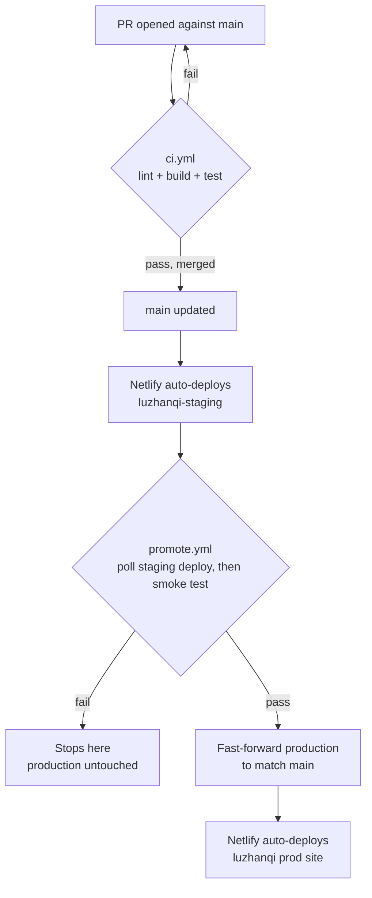

# Contributing to luzhanqi-web

## Workflow

1. Branch off `main` (`type/short-description`, e.g. `fix/last-move-arrow`,
   `feat/rule-variant-toggle`, `chore/dep-bump`, `docs/...`).
2. Open a PR into `main`. CI (`.github/workflows/ci.yml`: lint, build,
   `npm test`) must pass — it's a required status check, so the merge
   button stays disabled until it's green.
3. Use [Conventional Commits](https://www.conventionalcommits.org/)
   (`feat:`, `fix:`, `refactor:`, `style:`, `docs:`, `chore:`, optionally
   with a scope) for commit messages and PR titles.
4. Merge (this repo uses merge commits, not squash/rebase, so `git log`
   keeps a per-PR merge commit).

That's it from a contributor's side — everything after merge is automatic:

`main` is the staging trigger, `production` is the prod trigger — never
push directly to `production`, since only `promote.yml`'s fast-forward
should ever move it. If the smoke test fails, prod simply stays on its
last good commit; nothing rolls out until it passes.

## Local development

- `npm install`, then `npm run start` — Vite dev server. See `README.md`
  for the required `.env`/`.env.local`.
- There's no real automated test suite yet (`npm test` is a placeholder) —
  **verify UI changes by actually running the app and driving the feature
  in a browser**, not just by reading the diff. Send/take a screenshot for
  anything visual.
- `npm run lint` / `npm run build` — same checks CI runs, useful to run
  locally before pushing.

## Getting oriented

- `src/views/` — top-level pages (`Game.jsx` is the main game screen,
  `Menu.jsx` handles create/join/spectate).
- `src/contexts/GameContext.jsx` — single source of truth for game state;
  owns the socket connection and every socket event handler.
- `src/contexts/FirebaseContext.jsx` — Firebase Auth state; never
  fake/bypass this to get a logged-in user for testing.
- `src/components/GameBoard/` — the live gameplay board; `src/components/BoardSetup/`
  — the piece-placement (setup phase) board.
- Every player-facing string is gated on the `isEnglish` flag (English or
  Traditional Chinese) — new UI text needs both.
- A rule-variant change must be mirrored in `utils/predictOutcome.js` /
  `getSuccessors.js` here to match the backend's equivalent logic, or the
  optimistic move preview and the real outcome will disagree.
